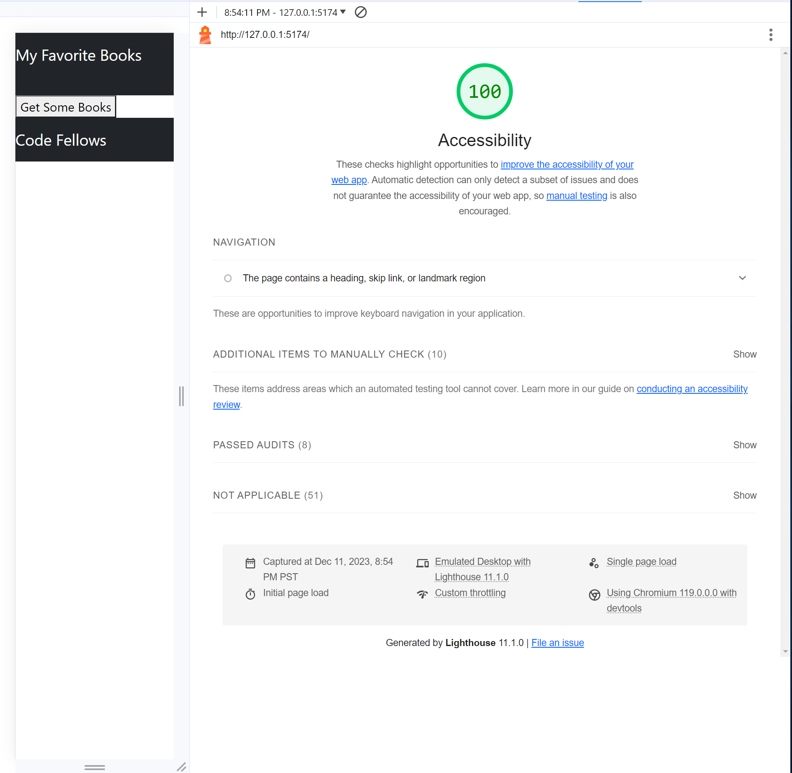
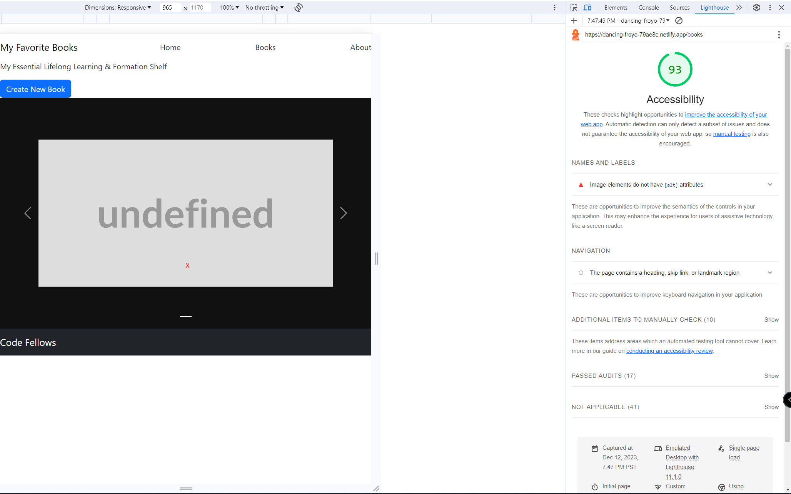

# Can of Books - Frontend

**Author**: Negin Koushkakinejad, Errol Vidad
**Version**: 1.0.0 (increment the patch/fix version number if you make more commits past your first submission)

## Overview
This application will allow users to add the name of books to a virtual book library. The user can rate books and store for future reference.

## Getting Started
Enter the URL Netlify url on a web browser to access their personal virtual book library
<!-- What are the steps that a user must take in order to build this app on their own machine and get it running? -->

## Architecture
React-Vite, node.js, express, Netlify, Render, MongoDB
<!-- Provide a detailed description of the application design. What technologies (languages, libraries, etc) you're using, and any other relevant design information. -->

## Change Log
12-11-2023 4:40 pm - Deployed front-end to Netlify and back-end to Render
12-12-2023 5:15 pm - Created carousel to display books in library and created modal to add new books to library
<!-- Use this area to document the iterative changes made to your application as each feature is successfully implemented. Use time stamps. Here's an example:

01-01-2001 4:59pm - Application now has a fully-functional express server, with a GET route for the location resource. -->

## Estimates
<!-- See below -->
Time Estimates
For each of the lab features, make an estimate of the time it will take you to complete the feature, and record your start and finish times for that feature:

Name of feature: Set up Repositories

Estimate of time needed to complete: 60 minutes

Start time: 3:30pm

Finish time: 4:30pm

Actual time needed to complete: 70 minutes

Name of feature: Book Component

Estimate of time needed to complete: 30 minutes

Start time: 2:30pm

Finish time: 2:45pm

Actual time needed to complete: 15 minutes

Name of feature: Connect front-end to back-end

Estimate of time needed to complete: 180 minutes

Start time: 2:45pm

Finish time: 5:15pm

Actual time needed to complete: 150 minutes

## Credit and Collaborations
<!-- Give credit (and a link) to other people or resources that helped you build this application. -->
Conducted pair programming with Negin K. for this project

